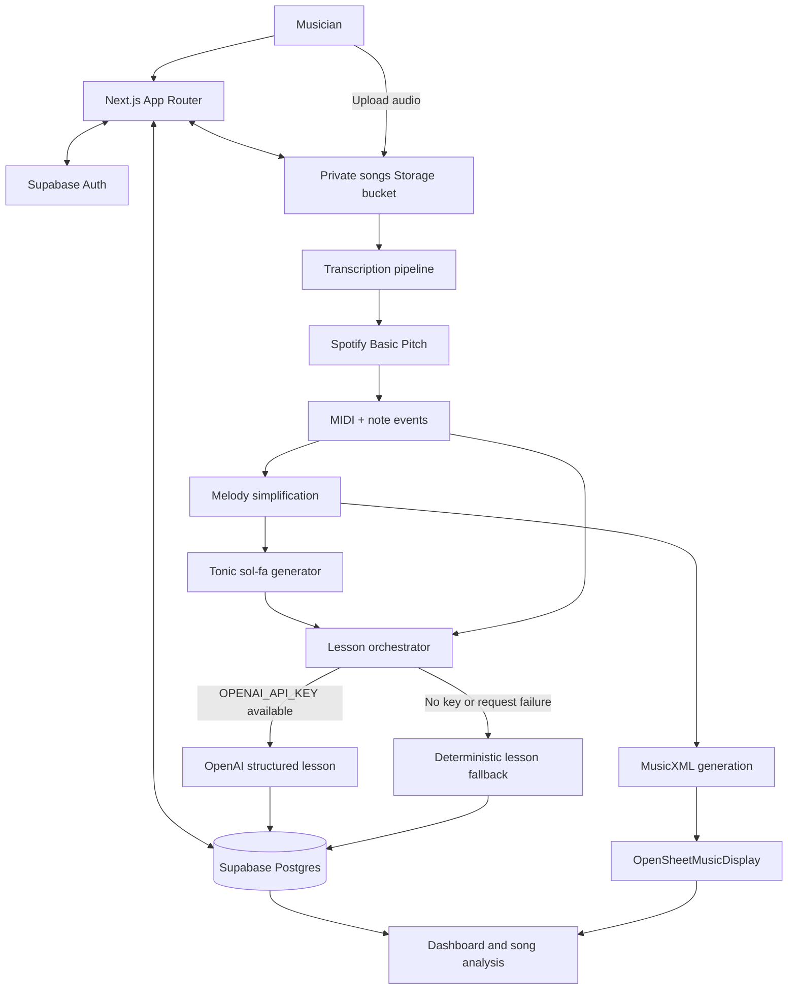

# 🎵 SolfaAI

> Turn any song into sheet music, tonic sol-fa, and personalized AI-powered music lessons.

[](https://nextjs.org/)
[](https://www.typescriptlang.org/)
[](https://supabase.com/)
[](https://gsap.com/)
[](https://openai.com/)
[](https://github.com/spotify/basic-pitch)
[](https://www.musicxml.com/)

SolfaAI makes music education more approachable. Instead of asking learners to translate a recording into theory, notation, and a practice routine by hand, it turns an uploaded song into structured musical material they can actually learn from—MIDI, sheet music, tonic sol-fa, analysis, and a lesson tailored to the song.

---

## Demo

- **Live demo:** _(https://solfa-ai.vercel.app/)_
- **Demo video:** _Coming soon_

---

## Features

| Area | What SolfaAI provides |
| --- | --- |
| Audio upload | Drag-and-drop or file-picker uploads for MP3, WAV, M4A, OGG, and FLAC recordings. |
| AI transcription | A staged processing experience that turns audio into structured musical data. |
| Spotify Basic Pitch | Pitch and timing detection for note events and source MIDI generation. |
| MIDI generation | Stores the original generated MIDI for download. |
| Melody simplification | Extracts a readable learning melody without altering the original MIDI. |
| MusicXML generation | Converts the simplified melody into portable notation data. |
| Sheet music | Renders MusicXML responsively with OpenSheetMusicDisplay. |
| Tonic sol-fa | Maps the simplified melody to key-aware tonic sol-fa notation. |
| AI lessons | Produces structured, song-specific practice guidance with GPT when available. |
| Offline lesson fallback | Generates a deterministic, personalized lesson when OpenAI is unavailable. |
| Music workspace | Dashboard, song library, song analysis, downloads, and progress summaries. |
| Authentication | Supabase SSR authentication, session persistence, recovery, and route protection. |
| Responsive polish | Premium light/dark themes, mobile navigation, loading states, and GSAP interactions. |

---

## Project Highlights

- AI-powered music transcription
- Automatic MusicXML generation
- Automatic tonic sol-fa conversion
- GPT-powered lesson generation
- Offline lesson fallback
- Interactive sheet music
- Secure authenticated dashboard
- Responsive design
- GSAP animations

---

## Screenshots

> Add project screenshots under `docs/screenshots/` and replace the placeholders below before publishing.

| Landing page | Dashboard |
| --- | --- |
| `docs/screenshots/landing-page.png` | `docs/screenshots/dashboard.png` |

| Song analysis | Sheet music | AI lesson |
| --- | --- | --- |
| `docs/screenshots/song-analysis.png` | `docs/screenshots/sheet-music.png` | `docs/screenshots/ai-lesson.png` |

---

## How it works

```text
Audio upload
    ↓
Spotify Basic Pitch
    ↓
MIDI
    ↓
Melody simplification
    ↓
MusicXML
    ↓
Sheet music + tonic sol-fa
    ↓
AI lesson
```

1. **Upload audio** — an authenticated user securely uploads a supported recording to their private Supabase Storage path.
2. **Transcribe with Basic Pitch** — Spotify Basic Pitch detects pitch and timing information and generates the original MIDI transcription.
3. **Simplify the melody** — simultaneous notes are grouped, the highest melody note is retained, transcription noise is filtered, and sustained phrases are merged where appropriate.
4. **Generate MusicXML** — the simplified melody is serialized into MusicXML and saved alongside the uploaded song.
5. **Render sheet music** — OpenSheetMusicDisplay engraves the generated MusicXML into responsive score notation.
6. **Create tonic sol-fa** — note events are interpreted relative to the estimated key and formatted into readable musical phrases.
7. **Build a lesson** — song analysis, melody data, and tonic sol-fa become a practical, personalized learning plan.

---

## Tech stack

| Layer | Technology |
| --- | --- |
| Frontend | Next.js 16 App Router, React 19, TypeScript, Tailwind CSS v4 |
| UI & motion | Motion, GSAP + ScrollTrigger, Lucide icons, shadcn/ui primitives |
| Database | Supabase Postgres |
| Authentication | Supabase SSR Auth |
| Storage | Private Supabase Storage bucket for audio, MIDI, and MusicXML |
| AI | OpenAI structured JSON lesson generation with a deterministic fallback |
| Music processing | Spotify Basic Pitch, Tone.js MIDI, custom melody simplification |
| Notation | MusicXML and OpenSheetMusicDisplay |
| Deployment | Any Next.js-compatible host with Supabase and environment variables configured |

---

## Architecture



---

## Local development

### Prerequisites

- Node.js 20+
- pnpm 9+
- A Supabase project with the existing `songs` table and private `songs` Storage bucket

### Install and run

```bash
npm install
cp .env.example .env.local
npm dev
```

Open [http://localhost:3000](http://localhost:3000).

Run a type check before submitting changes:

```bash
npx tsc --noEmit
```

---

## Environment variables

Create `.env.local` with the following values:

| Variable | Required | Purpose |
| --- | --- | --- |
| `NEXT_PUBLIC_SUPABASE_URL` | Yes | Supabase project URL used by browser and SSR clients. |
| `NEXT_PUBLIC_SUPABASE_ANON_KEY` | Yes | Public Supabase anonymous key used by browser and SSR clients. |
| `OPENAI_API_KEY` | No | Enables GPT-powered AI lessons. The deterministic fallback works without it. |
| `OPENAI_LESSON_MODEL` | No | Overrides the OpenAI lesson model. Defaults to `gpt-5-mini`. |
| `SUPABASE_SERVICE_ROLE_KEY` | No | Not read by the current application. Reserve it for future trusted server-only administration; never expose it to the browser. |

> Keep `.env.local` private. Do not commit credentials, service-role keys, or personal demo accounts.

---

## Reliable AI lessons

SolfaAI is deliberately designed to keep teaching even when an external model is unavailable.

```text
OPENAI_API_KEY present and request succeeds
    → GPT produces a structured personalized lesson

No API key, network failure, rate limit, or provider error
    → SolfaAI produces a deterministic lesson from transcription data
```

Both paths return complete structured content: an overview, difficulty explanation, warm-up exercises, practice plan, common mistakes, practice tips, and a next goal. This makes demos dependable and prevents an AI outage from becoming a learner-facing error.

---

## Engineering challenges

- **Audio transcription:** supporting common upload formats while preparing audio for Basic Pitch’s expected processing path.
- **Readable notation:** reducing dense polyphonic detections into a learning-friendly melody while preserving the original MIDI download.
- **MusicXML generation:** producing portable score data without blocking an otherwise successful transcription if notation fails.
- **Notation rendering:** loading private MusicXML safely and rendering it responsively in the product UI.
- **Offline-first lesson reliability:** providing useful learning guidance whether or not OpenAI is configured or reachable.
- **Authentication and ownership:** keeping songs, storage paths, and protected views scoped to the authenticated user.

---

## Future roadmap

- [ ] Import songs directly from YouTube, Spotify, Apple Music, and SoundCloud using a song URL.
- [ ] Search by song title and artist without uploading audio.
- [ ] AI-powered song insights, including artist information, song history, lyrical background, release details, and musical context.
- [ ] Interactive score playback with synchronized note highlighting.
- [ ] Real-time pitch detection and vocal feedback during practice.
- [ ] Choir and multi-part vocal transcription.
- [ ] Teacher dashboard for classrooms and music schools.
- [ ] Collaborative rehearsal spaces for ensembles and choirs.
- [ ] Mobile applications for iOS and Android.

---

## Team

### Oluwatimilehin Iseyemi
Founder & Full Stack Developer

Designed and built SolfaAI including:

- Product design
- Frontend
- Backend
- AI pipeline
- Music transcription
- Authentication
- Deployment

## License

This project is licensed under the [MIT License](LICENSE).
